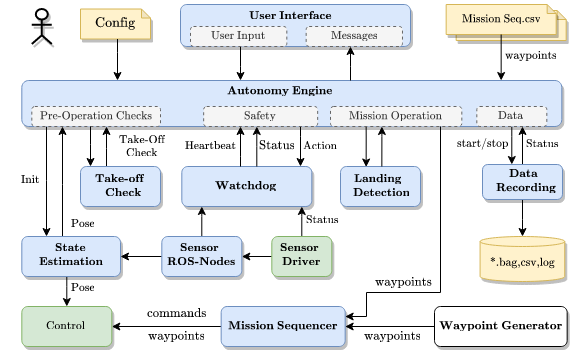

# CNS Flight Stack

[](https://github.com/aau-cns/flight_stack/releases)
[](https://github.com/aau-cns/flight_stack/actions/workflows/ros.yml)
[](https://github.com/aau-cns/flight_stack/blob/main/LICENSE)
[](https://doi.org/10.1109/LRA.2022.3196117)
[](https://youtu.be/VlLSCGWQHW8)

A ROS1 workspace to use the CNS Flight Stack: a UAV flight stack to autonomously perform reproducible and customizable missions.



Maintainers: [Christian Brommer](mailto:christian.brommer@aau.at), [Alessandro Fornasier](mailto:alessandro.fornasier@aau.at), and [Martin Scheiber](mailto:martin.scheiber@aau.at)

## Credit
This code was written by the [Control of Networked System (CNS)](https://www.aau.at/en/smart-systems-technologies/control-of-networked-systems/), University of Klagenfurt, Klagenfurt, Austria.

## License
This software is made available to the public to use (_source-available_), licensed under the terms of the BSD-2-Clause-License with no commercial use allowed, the full terms of which are made available in the `LICENSE` file. No license in patents is granted.

### Usage for academic purposes
If you use this software in an academic research setting, please cite the
corresponding [academic paper] and consult the `LICENSE` file for a detailed explanation.

```latex
@article{cns_flightstack22,
    title        = {CNS Flight Stack for Reproducible, Customizable, and Fully Autonomous Applications},
    author       = {Scheiber, Martin and Fornasier, Alessandro and Jung, Roland and Böhm, Christoph and Dhakate, Rohit and Stewart, Christian and Steinbrener, Jan and Weiss, Stephan and Brommer, Christian},
    journal      = {IEEE Robotics and Automation Letters},
    volume       = {7},
    number       = {4},
    year         = {2022},
    doi          = {10.1109/LRA.2022.3196117},
    url          = {https://ieeexplore.ieee.org/document/9849131},
    pages        = {11283--11290}
}
```

[](https://youtu.be/VlLSCGWQHW8)

## Tutorial

Please consult the [Wiki](https://github.com/aau-cns/flight_stack/wiki) for a detailed tutorial on installation, configuration, and usage.

## Setup and compile the project

```bash
# Get the ros package
git clone https://github.com/aau-cns/flight_stack.git cns_flightstack
cd cns_flightstack
git submodule update --init --recursive

# Build the project
catkin init
catkin build
```

After building you can install the launch scripts with
```bash
sudo ./scripts/install_scripts.sh
```

Then, launching the flight stack is possible via

- `fs_remote <USER>@<IP>` to launch the flight stack remotely with user `ID` at the device with IP `IP`
- `fs_dev<1|2>` to launch the flight stack on device 1 or 2
- `fs_op` to launch the operator window, i.e., autonomy engine only

Please consult `fs_<SCRIPT> -h` for further information.

## Isolated Build with Docker

```sh
cd cns_flightstack # enter flight stack directory
docker build --network=host -t cns_flight_stack_test_env:latest docker/ # Build the Docker image

# The following runs the container, maps the source code (read only)
# and executes the script in 'docker/docker_application_test.sh'
docker run -it --rm \
  --network=host \
  -v "$(pwd)/src":/source:ro \
  cns_flight_stack_test_env:latest
```
Please do not forget to build your workspace inside the docker test container, as the source is just linked to your host.

## Deployment Details

| Type | Status|
|:----:|:-----:|
| Release |   |
| Debug |   |

<!-- LINKS: -->
[academic paper]: https://ieeexplore.ieee.org/document/9849131