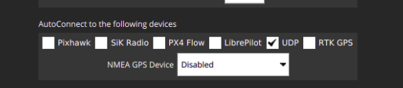

# AMADEE 2020 catkin workspace

The project uses the X-quad copter [TwinScience_V1](https://gitlab.aau.at/aau-nav/development/twins_science_qcopter) build by the Austrian company [Twins](https://start.twins.co.at/). It is build upon the [Pixhawk 4](doc/Pixhawk4.md) flight controller.  

## How to run the example

```
# init git submodules
./init
# build from source
catkin_make all run_tests -j 1
# add your packages to the ROS environment
source devel/setup.bash
# start the mission
roslaunch bringup mission1.launch
```

For further detail about the scripts and maintainance of an catkin workspace follow:
https://gitlab.aau.at/aau-nav/development/examples/example_catkin_ws

## Requirements

1. Install latest [QGroundControl](https://docs.qgroundcontrol.com/en/getting_started/download_and_install.html) (QGC):
1. Mavlink compatible Flight-Control-Unit (FCU): e.g. [Pixhawk 4](https://docs.px4.io/v1.9.0/en/flight_controller/pixhawk4.html) flashed with the [Ardupilot-Copter](http://ardupilot.org/) or [PX4 flight stack](https://docs.px4.io/master/en/index.html). [Changing the firmware](https://docs.qgroundcontrol.com/en/SetupView/Firmware.html) can be done with QGC.
1. Serial link between FCU (Telemetry 1: 921600 baud, 8N1) and PC:
1. connect the Logitec F710 joy pad via USB dongle with our PC.


## Running the system

Use multiple terminals:


Terminal2:
```
roslaunch mavros apm.launch fcu_url:=/dev/ttyUSB0:921600 gcs_url:=udp://@localhost
```

Terminal3:
```
roslaunch ros_gamepad_teleop twist2pose.launch
```

Terminal1:
```
$ ./QGroundControl.AppImage
```
**HINT:** If your flight controller controller is directly connected via a serial interface with the PC running QGC, turn off the auto-connect feature. If not, `mavros` will display an `End of file` error, as it loses access to the file handle of the serial port!

## Findings

1. FCU: ArduCopter V3.6.9
1. This starts mavproxy so that the serial link to the companion computer (on /dev/ttyUSB0) is available to a companion computer and external GCSs via UDP
```
 mavproxy.py --master /dev/ttyUSB0 --baud 921600 --out udpin:localhost:9000 --out udpbcast:192.168.42.255:14550
```
1. Set the streaming rate (different groups are supported (raw-sensor, all, etc.)):
```
mavros/scripts$ python mavsys rate --raw-sensor 25
```
1. Get and set Waypoints:
```
mavros/scripts$ python mavwp pull
mavros/scripts$ python mavwp show --full
```
1. Arm and disarming the device
```
mavros/scripts$ python mavsafety arm
mavros/scripts$ python mavsafety disarm
```
1. [Ardupilot-GCS_Mavlink](https://github.com/tridge/ardupilot/blob/master/ArduCopter/GCS_Mavlink.cpp)
1.


## Links

1. [MAVProxy](https://github.com/ArduPilot/MAVProxy) This is a MAVLink ground station written in python.
1. [PyMAVLink](https://github.com/ArduPilot/pymavlink) python MAVLink interface and utilities
1. [Ardupilot Source](https://github.com/ArduPilot/ardupilot) ArduPlane, ArduCopter, ArduRover source: http://ardupilot.org/
1. [Mavlink Source](https://github.com/mavlink/mavlink) Marshalling / communication library for drones. https://mavlink.io/en/
1. [MAVROS](https://github.com/mavlink/mavros)
1. [Mavlink - c_uart_interface_example](https://github.com/mavlink/c_uart_interface_example)
1. [QGroundControl Source](https://github.com/mavlink/qgroundcontrol) Cross-platform ground control station for drones (Android, iOS, Mac OS, Linux, Windows) http://qgroundcontrol.io
1. [PX4 Source](https://github.com/PX4/Firmware)
1. [PX4 Dev Guide](http://dev.px4.io/master/en/)

### Indoor Fligths

1. [Chobitsfan's Blog](https://discuss.ardupilot.org/t/indoor-flight-with-external-navigation-data/29980/6)
1. [Vicon Example](http://ardupilot.org/copter/docs/common-vicon-for-nongps-navigation.html)

### Others

1. [Arduino + Mavlink](https://discuss.ardupilot.org/t/mavlink-and-arduino-step-by-step/25566)
1. [Dronekit Python](https://github.com/dronekit/dronekit-python/blob/master/docs/guide/copter/guided_mode.rst)


Specify the date-time on a remote machine that has no access to Internet:
```
ssh pi@10.5.1.190 sudo date -s @`( date -u +"%s" )`
```

## Architecture

Get an overview of the possible [architectures](doc/architectures.md).

## Possible Packages:

1. [ros_mavros_wp_mission](https://github.com/jungr-ait/ros_mavros_wp_mission)
1. [offboard](https://github.com/jungr-ait/offboard)

Further interessting Packages:

1. [State Monitor](https://github.com/ethz-asl/state_monitor)
1. [ROS-serial](http://wiki.ros.org/rosserial)
1. [Geodestic Utils](https://github.com/ethz-asl/geodetic_utils)

## Simulation / Testing

1. [PX4-simulation](http://dev.px4.io/master/en/simulation/)


## Known issues
If the ids camera is not recognized then restarting the service can fix this issue:

```sh
sudo systemctl restart ueyeusbdrc
```