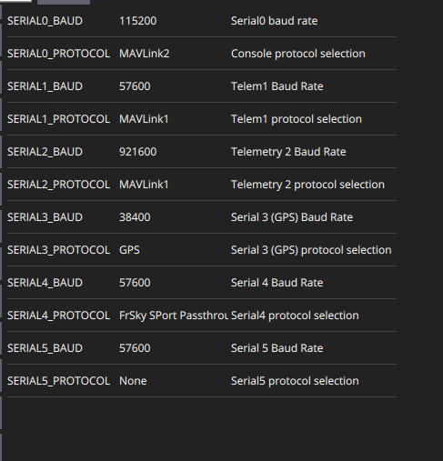

# Pixhawk4 by Holybro

[Pixhawk​​ 4 flight controller](https://shop.holybro.com/c/pixhawk-4_0485) is the latest update in 2019 to the successful family of Pixhawk flight controllers. It is designed and developed in collaboration with Holybro and Auterion, optimized to run PX4. It comes preinstalled with the latest PX4 firmware. Twins ships it with the latest ArduPilot-Copter firmware.

## Communication interfaces

**HINT:** We could use Serial5 for our purposes! 
